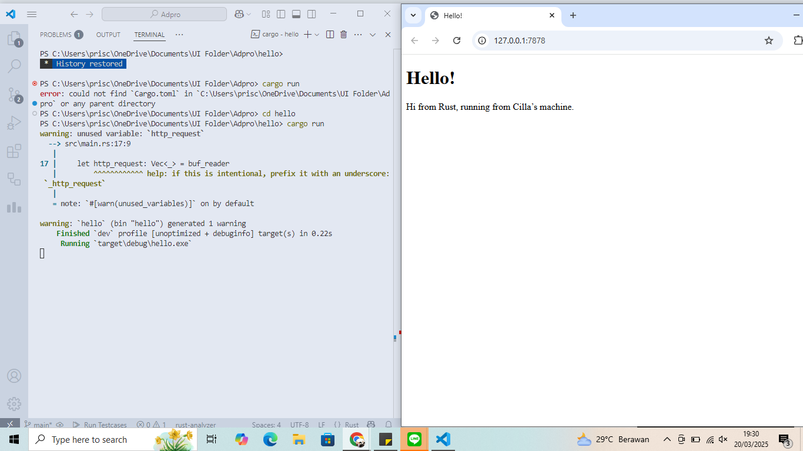
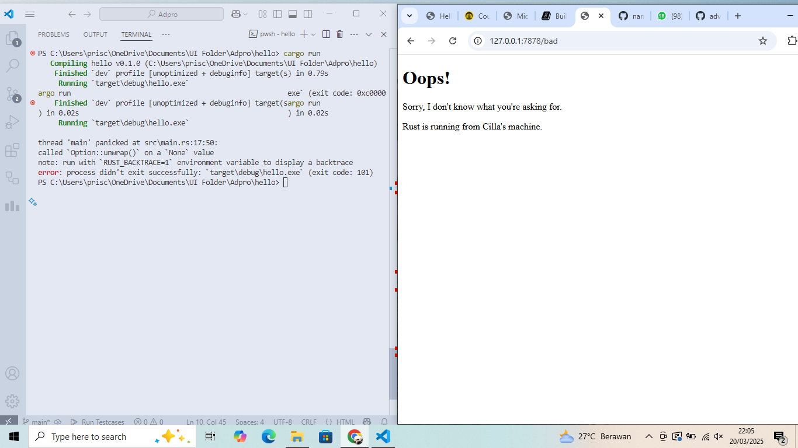

## (1) Commit 1 Reflection

Secara singkat, fungsi handle_connection berguna untuk memproses permintaan klien, yaitu koneksi TCP yang masuk dari TcpListener.

---
``` rust
fn handle_connection(mut stream: TcpStream) {
```
Pada potongan kode di atas, dapat dilihat bahwa fungsi menerima parameter `TcpStream` yang mewakili koneksi aktif antara server dan klien. `mut` menunjukkan bahwa `stream` akan dimodifikasi dalam fungsi.

---
``` rust
let buf_reader = BufReader::new(&mut stream);
```
`BufReader` dibuat dari `stream` untuk membaca data per baris secara efisien. Selain itu, `BufReader` juga membungkus `TcpListener` agar lebih mudah membaca permintaan HTTP.

---
``` rust
let http_request: Vec<_> = buf_reader 
    .lines()
    .map(|result| result.unwrap()) 
    .take_while(|line| !line.is_empty()) 
    .collect();
```
- `buf_reader.lines()` menggunakan iterator untuk membaca koneksi per baris. 
- `.map(|result| result.unwrap())` melakukan ekstraksi string dari `Result<String, Error>`
- `.take_while(|line| !line.is_empty())` akan terus membaca semua baris sampai menemukan baris kosong.
- `.collect()` menyatukan semua baris yang tidak kosong ke dalam `Vec<String>`.

---
``` rust
println!("Request: {:#?}", http_request);
```
Baris permintaan HTTP yang dikumpulkan dicetak dalam format debug, untuk membantu proses debugging.

## (2) Commit 2 Reflection

Setelah dimodifikasi, fungsi `handle_connection` sekarang berguna untuk membaca permintaan HTTP dan merespons dengan file HTML. 

---
Modifikasi tambahan kode yang dilakukan:
``` rust
let status_line = "HTTP/1.1 200 OK";
let contents = fs::read_to_string("hello.html").unwrap();
let length = contents.len();
```
- `status_line = "HTTP/1.1 200 OK"` menentukan status HTTP untuk respons, yaitu `200 OK` berarti permintaan berhasil. 
- `fs::read_to_string("hello.html").unwrap()` membaca isi file hello.html, jika file tidak ditemukan maka `unwrap()` akan menyebabkan error dan program berhenti.
- `length = contents.len();` menyimpan panjang file dalam byte.
---
``` rust
let response =
    format!("{status_line}\r\nContent-Length:
{length}\r\n\r\n{contents}");
```
Untuk membentuk respons yang akan dikirim ke klien.

---
``` rust
stream.write_all(response.as_bytes()).unwrap();
```
Mengonversi respons menjadi byte dan mengirimkannya melalui `TcpStream`, sehingga dikirim kembali ke klien.



## (3) Commit 3 Reflection
### How to split between response
Cara untuk memisahkan antara respon yang berbeda dilakukan berdasarkan tiga aspek, yaitu request method, path, dan HTTP version dari HTTP Headers. Berikut potongan kode yang bertanggung jawab atas ini.
``` rust
 let (status_line, filename) = if request_line == "GET / HTTP/1.1" {
        ("HTTP/1.1 200 OK", "hello.html")
    } else {
        ("HTTP/1.1 404 NOT FOUND", "404.html")
    };
```
Kode ini akan memisahkan respon berdasarkan request line, yaitu `GET / HTTP/1.1` berarti pada path `/` atau home page akan ditampilkan teks "Hello!", sementara path selain itu akan menampilkan teks "Oops!".

### Why refactoring is needed
Refactoring dibutuhkan agar struktur kode lebih rapi dan mudah dibaca namun fungsionalitas kode tetap terjaga. Pada milestone ini, refactoring membuat kode tidak redundant/terulang (di bagian definisi response, misalnya mendefinisikan `status_line`, menentukan `Content_Length`, dan sebagainya) dan membuat kode lebih jelas dan mudah untuk dipelihara serta diperbarui.



## (4) Commit 4 Reflection
Jika kita membuka `127.0.0.1/sleep`, server akan memberhentikan eksekusi selama 5 detik. Selama pemberhentian ini, seluruh proses di server akan diblokir karena aplikasi masih berupa single-thread. Walaupun kita membuka `127.0.0.1/` di browser lain, jika permintaan sebelumnya (`127.0.0.1/sleep`) masih berjalan, permintaan yang baru akan di-delay sampai permintaan sebelumnya selesai. Hal ini disebabkan eksekusi single-thread hanya bisa memproses satu permintaan di satu waktu.

## (5) Commit 5 Reflection
ThreadPool bekerja dengan cara menggunakan ulang thread yang sudah ada, sekaligus menghindari server overload dengan membatasi jumlah request yang dijalankan bersamaan. ThreadPool memungkinkan eksekusi beberapa request di waktu yang bersamaan, dengan membagi request ke worker thread yang ada. Oleh karena itu, kita bisa menangani beberapa request sekaligus secara paralel dan lebih efisien.